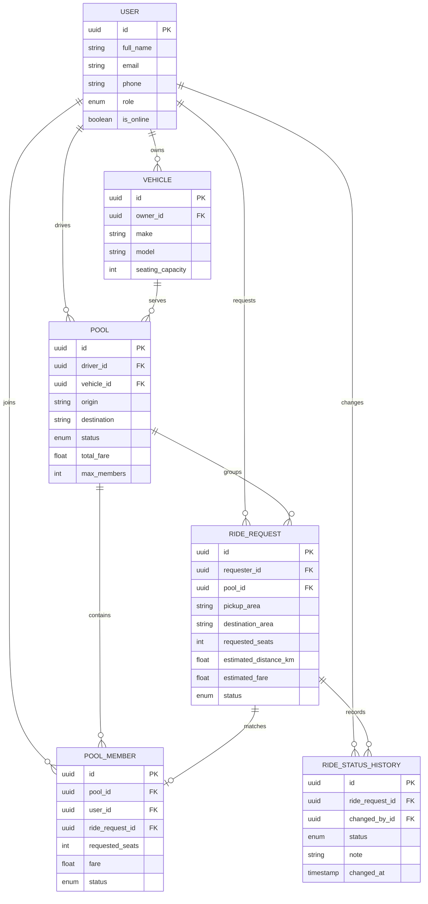

# Dhaka Tesla Pool

Dhaka Tesla Pool is a shared-ride coordination application for passengers and drivers. Passengers can request rides, see fare estimates, track status, cancel eligible requests, and review history. Drivers can manage availability, accept ride requests, progress rides through their lifecycle, and inspect current pool and ride history.

The project is implemented as a Next.js frontend, a NestJS REST API, and PostgreSQL, with Docker Compose providing a reproducible local stack.

## Tech Stack

- **Frontend:** Next.js 16 App Router, React 19, TypeScript, Tailwind CSS 4
  - Provides a small client-side role-based dashboard and a same-origin API proxy.
- **Backend:** NestJS 11, TypeScript, TypeORM
  - Provides modular authentication, ride requests, driver operations, matching, and lifecycle services.
- **Database:** PostgreSQL 16
  - Stores users, vehicles, pools, pool members, ride requests, and status history.
- **Authentication:** JWT bearer tokens with bcrypt password hashing
- **Local orchestration:** Docker Compose with service healthchecks and migration startup

## Project Layout

```text
.
├── backend/       NestJS API and TypeORM migrations
├── frontend/      Next.js application
├── docker-compose.yml
└── README.md
```

## Local Setup

### Option A: Docker Compose

This is the recommended path because it starts PostgreSQL, runs migrations, starts the API, and then starts the frontend only after the API is healthy.

```bash
cp .env.example .env
# Edit .env and replace the local development values if needed.
docker compose up --build
```

PowerShell:

```powershell
Copy-Item .env.example .env
docker compose up --build
```

Open:

- Frontend: http://localhost:3001
- Backend health: http://localhost:3000/health
- PostgreSQL from the host: `localhost:5433`

The backend container uses the PostgreSQL service name (`postgres`) and port `5432`. The host port is `5433` to avoid requiring a local PostgreSQL installation.

To reset the database and rerun every migration:

```bash
docker compose down -v --remove-orphans
docker compose up --build
```

The `down -v` command deletes local Compose database data.

### Option B: Run Services Manually

Start PostgreSQL separately, then configure the backend to use the database host and port reachable from the host.

Backend:

```bash
cd backend
npm install
cp .env.example .env
npm run migration:run
npm run start:dev
```

Frontend:

```bash
cd frontend
npm install
# BACKEND_URL defaults to http://localhost:3000
npm run dev -- --port 3001
```

The frontend proxy sends `/api/*` requests to `BACKEND_URL` and removes the `/api` prefix before forwarding.

## Environment Variables

Never commit real secrets. Use the checked-in examples as templates.

### Root Compose `.env`

| Variable | Purpose | Compose default |
| --- | --- | --- |
| `DB_PASSWORD` | PostgreSQL and backend database password | `tesla_dev_password` |
| `JWT_SECRET` | JWT signing secret | local development placeholder |

### Backend `backend/.env`

| Variable | Purpose | Local Docker value |
| --- | --- | --- |
| `DB_HOST` | PostgreSQL hostname | `postgres` in Compose, `localhost` for host execution |
| `DB_PORT` | PostgreSQL port | `5432` in Compose, usually `5433` from the host |
| `DB_USERNAME` | PostgreSQL user | `tesla` |
| `DB_PASSWORD` | PostgreSQL password | local secret |
| `DB_NAME` | PostgreSQL database | `tesla_pool` |
| `JWT_SECRET` | JWT signing secret | local secret |
| `PORT` | NestJS HTTP port | `3000` |

### Frontend `frontend/.env`

| Variable | Purpose | Compose value |
| --- | --- | --- |
| `BACKEND_URL` | Server-side Next.js rewrite target | `http://backend:3000` |

## API Summary

All protected endpoints require:

```http
Authorization: Bearer <access-token>
```

### Public

| Method | Endpoint | Description |
| --- | --- | --- |
| `POST` | `/auth/signup` | Create a passenger or driver account and return a JWT session |
| `POST` | `/auth/login` | Authenticate by email and password |
| `GET` | `/health` | Container health endpoint; returns `{ "status": "ok" }` |

### Passenger Endpoints

| Method | Endpoint | Description |
| --- | --- | --- |
| `POST` | `/ride-requests` | Create a ride request with pickup, destination, seats, and distance |
| `GET` | `/ride-requests/current` | Get the authenticated passenger's latest active ride |
| `GET` | `/ride-requests/history` | Get the passenger's completed and cancelled rides |
| `POST` | `/ride-requests/:rideRequestId/cancel` | Cancel an owned ride in `requested` or `matched` state |

### Driver Endpoints

| Method | Endpoint | Description |
| --- | --- | --- |
| `PATCH` | `/driver/status` | Set the authenticated driver online or offline |
| `GET` | `/driver/vehicle` | Get the authenticated driver's assigned vehicle |
| `GET` | `/driver/current` | Get the driver's latest active pool with members and rides |
| `GET` | `/driver/history` | Get completed/cancelled pool member rides owned by the driver |
| `POST` | `/ride-requests/:rideRequestId/accept` | Accept a requested ride into a compatible pool |
| `POST` | `/ride-requests/:rideRequestId/arrive` | Mark an assigned ride as driver-arrived |
| `POST` | `/ride-requests/:rideRequestId/start` | Start a ride after arrival |
| `POST` | `/ride-requests/:rideRequestId/complete` | Complete a started ride |

Driver endpoints enforce the driver role. Passenger reads and cancellation are scoped to the authenticated passenger. Driver lifecycle transitions verify ownership of the assigned vehicle.

The existing backend does not expose a list endpoint for all unassigned requested rides. The frontend therefore uses the existing accept-by-ride-ID endpoint rather than adding a new request-list feature.

## Architecture

The backend uses NestJS modules around the domain boundaries:

- `AuthModule`: signup, login, JWT, and authentication guard
- `RideRequestsModule`: request creation, passenger reads, cancellation, and fare calculation
- `DriversModule`: driver availability and driver-owned read APIs
- `PoolMatchingModule`: driver acceptance, route compatibility, and ride lifecycle transitions
- `database`: entities, enums, datasource, and migrations

The frontend is a single Next.js App Router screen with a persisted JWT session. It renders a passenger or driver dashboard based on the authenticated role. Browser requests use `/api` and are proxied by Next.js to the backend, avoiding a local browser CORS dependency.

The backend starts with `synchronize: false`. The production Docker command runs compiled TypeORM migrations before starting NestJS.

## Database / ERD

The core relationships are:



Migrations are ordered under `backend/src/database/migrations` and are safe to run on a fresh schema. The initial schema creates the current tables, while later migrations guard existing columns/constraints and add authentication, estimates, driver availability, pool matching fields, and lifecycle enum values.

## Ride Lifecycle

The implemented ride statuses are:

```text
requested -> matched -> driver_arrived -> started -> completed
     \           
      -> cancelled
```

`accepted` and `in_progress` are represented in the database enum for compatibility with the PRD and current data model. The active read APIs include those statuses, while the implemented driver transition endpoints currently use:

- `matched` or `accepted` -> `driver_arrived`
- `driver_arrived` -> `started`
- `started` -> `completed`
- passenger cancellation from `requested` or `matched` only

Cancellation is rejected after driver arrival, start, or completion, and each successful transition writes a `RideStatusHistory` row.

## Matching and Pooling Rules

When a driver accepts a requested ride:

1. The driver must be online and have an assigned vehicle.
2. The requested seats must fit the vehicle capacity.
3. Existing active pools for that vehicle are considered when they are `open` or `full`.
4. An `open` pool is reused only when pickup matches and destinations are compatible.
5. The supported corridor allows `Banani`, `Gulshan`, and `Mohakhali` destinations to share a route when pickup is the same.
6. If no compatible pool exists, a new pool is created.
7. Pool status becomes `full` when requested seats reach vehicle capacity; otherwise it remains `open`.

Cancellation removes the matching pool member, subtracts its fare, recalculates pool capacity/status, clears the ride's pool relation, and records cancellation history in one transaction.

## Fare Calculation

The fare calculation service uses the PRD formula:

```text
fare = 50 + (estimated_distance_km * 20) + ((requested_seats - 1) * 20)
```

The result is rounded to two decimal places. The same formula is used for the passenger estimate and matching-time fare.

## Concurrency and Locking

Write operations that can race use TypeORM transactions and PostgreSQL pessimistic write locks:

- Ride acceptance locks the ride request and the driver's vehicle before checking status and capacity.
- Lifecycle transitions lock the ride request before verifying driver ownership and allowed status.
- Cancellation locks the ride request and its pool member before removing membership and updating pool totals/status.

This keeps status transitions, capacity checks, pool membership, fare totals, and status history changes consistent when multiple requests arrive together.

## Testing

Backend build:

```bash
cd backend
npm run build
```

Backend unit tests:

```bash
cd backend
$env:NODE_OPTIONS="--experimental-vm-modules"; npm test -- --runInBand
```

The Node option is required by the repository's current Jest/CommonJS and ESM dependency combination on this local setup. Focused specs can be run by passing a test path after `--runInBand`.

Backend end-to-end tests and coverage:

```bash
cd backend
npm run test:e2e
npm run test:cov
```

Frontend validation:

```bash
cd frontend
npm run lint
npm run build
```

## Docker Usage

Build and run all services:

```bash
docker compose up --build
```

Run detached:

```bash
docker compose up --build -d
```

Inspect status and logs:

```bash
docker compose ps
docker compose logs -f backend
docker compose logs -f frontend
docker compose logs -f postgres
```

Fresh database validation/reset:

```bash
docker compose down -v --remove-orphans
docker compose up --build
```

Compose uses health-gated dependencies: backend waits for PostgreSQL, and frontend waits for backend `/health`. The backend startup command runs migrations before NestJS starts.

## Git Workflow

Use a feature branch for each scoped change:

```bash
git switch -c feature/<short-description>
git status
git add <files>
git commit -m "Describe the focused change"
git push -u origin feature/<short-description>
```

Before opening a pull request:

1. Review `git diff` and `git status`.
2. Run backend tests/build and frontend lint/build.
3. Run `docker compose up --build` when the change affects runtime, migrations, or environment configuration.
4. Keep commits focused and avoid committing `.env` files, secrets, build output, or local database volumes.

## AI Usage Disclosure

AI assistance was used for codebase exploration, implementation support, test scaffolding, Docker troubleshooting, and documentation drafting. All generated changes were reviewed against the PRD and verified with builds, tests, and a fresh Docker Compose database.

- **Accepted suggestion:** Use a transaction with PostgreSQL pessimistic write locks for ride acceptance and cancellation. This was accepted because pool capacity, ride status, membership, fare totals, and history must change atomically under concurrent requests.
- **Rejected/changed suggestion:** An AI suggestion to add a new backend endpoint listing all unassigned driver requests was not accepted. The scope required using existing APIs and avoiding new business features, so the frontend uses the existing accept-by-ride-ID endpoint and documents that limitation instead.
